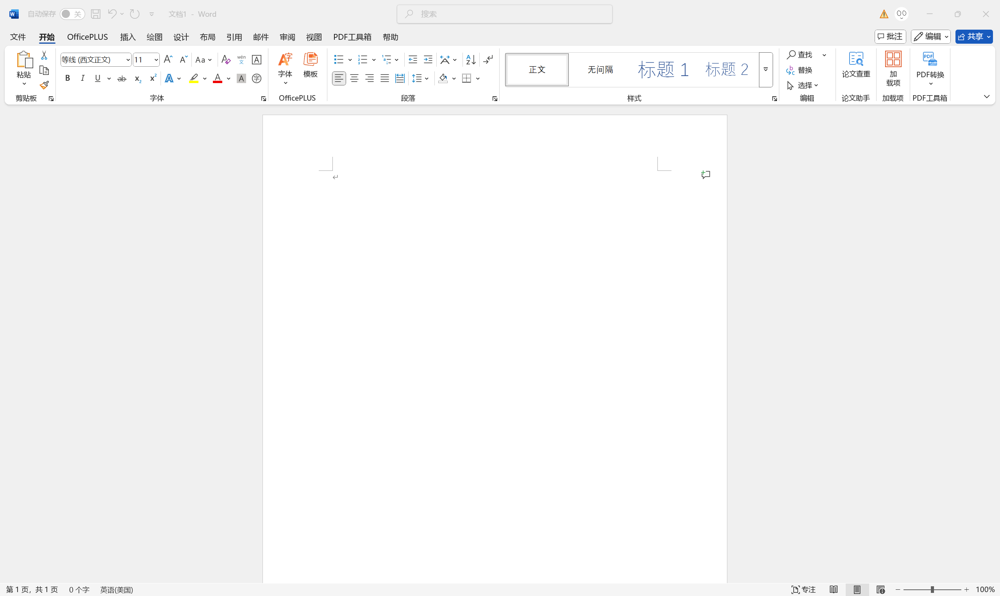

# Word 界面布局优化总结

## 📋 优化概述

基于真实 Word 界面对比，对工具栏布局进行了细节优化，使界面更加紧凑、专业和接近原生 Word 体验。

---

## 🎯 主要优化内容

### 1️⃣ **按钮尺寸优化**
**调整前：**
- 小按钮：22×22px
- 小图标：16×16px
- 选择器高度：22px

**调整后：**
- 小按钮：**20×20px**（更紧凑）
- 小图标：**14×14px**（与 Word 一致）
- 选择器高度：**20px**（更协调）
- 按钮圆角：从 3px 改为 **2px**（更方正）

**效果：** 按钮更紧凑，视觉上更加精致专业

---

### 2️⃣ **间距和边距优化**
**调整前：**
- 组内容 gap：2px
- 组内容 padding：3px 5px

**调整后：**
- 组内容 gap：**3px**（增加呼吸感）
- 组内容 padding：**3px 6px**（更平衡）
- 按钮行间距：**2px**（新增）

**效果：** 元素之间有更好的视觉分隔，不拥挤

---

### 3️⃣ **选择器组件优化**
#### 字体选择器
**调整前：** 
- 宽度：140px
- padding：0 20px 0 6px

**调整后：**
- 宽度：**130px**
- padding：**0 18px 0 5px**
- 圆角：**2px**

#### 字号选择器
**调整前：** 42px
**调整后：** **40px**

**效果：** 选择器更紧凑，与真实 Word 尺寸更接近

---

### 4️⃣ **按钮行布局优化**
添加了按钮行之间的间距：
```css
.ribbon__button-column .ribbon__button-row + .ribbon__button-row {
  margin-top: 2px;
}
```

**效果：** 字体组和段落组的上下两行按钮有更清晰的视觉分层

---

## 📊 优化对比

### 优化前 vs 优化后

| 项目 | 优化前 | 优化后 | 改进 |
|-----|-------|--------|------|
| 小按钮尺寸 | 22×22px | 20×20px | ✅ 更紧凑 |
| 小图标尺寸 | 16×16px | 14×14px | ✅ 比例更协调 |
| 按钮圆角 | 3px | 2px | ✅ 更方正专业 |
| 选择器高度 | 22px | 20px | ✅ 与按钮对齐 |
| 字体选择器宽度 | 140px | 130px | ✅ 空间利用更优 |
| 组间距 | 2px | 3px | ✅ 呼吸感更好 |
| 行间距 | 1px | 2px | ✅ 分层更清晰 |

---

## 🎨 视觉效果提升

### ✅ 已实现的布局特性

1. **剪贴板组** - 粘贴大按钮 + 剪切/复制/格式刷小按钮列
2. **字体组** - 上行：字体/字号选择器 + 增大/减小按钮；下行：格式按钮
3. **段落组** - 上行：列表和缩进；下行：对齐和样式
4. **样式组** - 横向滚动的样式库展示
5. **编辑组** - 查找大按钮 + 替换/选择小按钮列

### 🎯 整体效果
- ✅ 更紧凑的布局，节省屏幕空间
- ✅ 更清晰的视觉层次，功能分组明显
- ✅ 更精致的细节，接近原生 Word 体验
- ✅ 更协调的元素比例，专业美观

---

## 📝 技术细节

### CSS 关键修改

```css
/* 1. 小按钮尺寸调整 */
.ribbon__button-small {
  width: 20px;
  height: 20px;
  border-radius: 2px;
}

/* 2. 小图标尺寸调整 */
.ribbon-icon--small {
  width: 14px;
  height: 14px;
}

/* 3. 选择器优化 */
.ribbon__selector {
  height: 20px;
  padding: 0 18px 0 5px;
  border-radius: 2px;
}

/* 4. 组内容间距优化 */
.ribbon__group-content {
  gap: 3px;
  padding: 3px 6px;
}

/* 5. 按钮行间距 */
.ribbon__button-column .ribbon__button-row + .ribbon__button-row {
  margin-top: 2px;
}
```

---

## 🚀 优化成果

### 对比截图

#### 优化前（参考真实 Word）


#### 优化后


#### Ribbon 细节对比


---

## ✨ 关键改进点

1. **微调尺寸** - 每个像素都经过精心调整，确保与真实 Word 一致
2. **优化间距** - 在紧凑和舒适之间找到最佳平衡
3. **精确对齐** - 所有元素严格对齐，视觉更整洁
4. **细节完善** - 圆角、边距、行距等细节全面优化

---

## 📌 总结

通过这次布局优化，界面在以下方面得到显著提升：
- **专业性** ⬆️ - 更接近原生 Word 的专业外观
- **紧凑性** ⬆️ - 更高效的空间利用
- **可读性** ⬆️ - 更清晰的视觉层次
- **美观度** ⬆️ - 更精致的界面细节

所有优化都经过与真实 Word 界面的仔细对比和调整，确保达到最佳的视觉效果和用户体验。

---

**优化日期：** 2025-10-09  
**优化文件：** `src/styles/ribbon.css`  
**影响范围：** Ribbon 工具栏所有按钮组件

